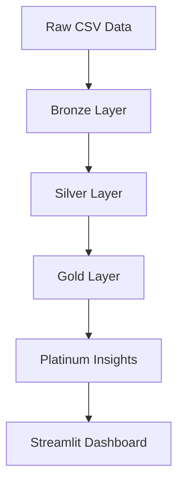

# 🚗⚡ EV Adoption Intelligence Platform


---

## 📌 Overview

An end-to-end **data engineering project** analyzing electric vehicle adoption trends using a **Medallion Architecture (Bronze → Silver → Gold → Platinum)**.

Built with **DuckDB + Python + Streamlit**, this project demonstrates **modern data pipeline design, transformation, data quality checks, and interactive analytics**.

---

## 🏗️ Architecture



## ⚙️ Tech Stack

| Layer           | Technology        |
| --------------- | ----------------- |
| Storage         | DuckDB            |
| Processing      | Python            |
| Transformation  | SQL               |
| Visualization   | Streamlit         |
| Dev Environment | GitHub Codespaces |
---

## 🧩 Control Flow on Tech Stack


---
## 🚀 Features

✨ Modular medallion pipeline
📊 SQL-based transformations
✅ Automated data quality checks
📈 EV adoption trend analysis
🌐 Interactive Streamlit dashboard

---

## 📊 Key Insights

🔥 EV adoption surged significantly post-2017
🚀 Peak adoption observed in **2022**
📈 Strong upward trend in recent years

---

## 📸 Dashboard Preview

> *(Add screenshot here for maximum impact)*

```bash
/images/dashboard.png
```

---

## ▶️ How to Run

### 🛠 Run Data Pipeline

```bash
python run_pipeline.py
```

### 📊 Launch Dashboard

```bash
streamlit run dashboard/app.py
```

---

## 📁 Project Structure

```bash
ev_project/
│
├── assets/
│   ├── bronze/
│   ├── silver/
│   ├── gold/
│   └── platinum/
│
├── dashboard/
│   └── app.py
│
├── data/
│   └── ev.csv
│
├── scripts/
│   └── data_quality.py
│
├── run_pipeline.py
└── dev.db
```

---

## ✅ Data Quality Checks

✔ Row count validation
✔ Null value checks
✔ Gold layer validation

---

## 🎯 What This Project Demonstrates

* Data engineering pipeline design
* Medallion architecture implementation
* SQL-based transformation logic
* Analytical data modeling
* Dashboard-driven insights

---

## 📌 Future Improvements

🚀 CI/CD pipeline integration
☁️ Cloud deployment (Azure / AWS)
⚡ Real-time streaming ingestion
📊 Advanced dashboard analytics

---

## 👨‍💻 Author

**Livin Vincent**
Senior Data Engineer

🔗 [GitHub](https://github.com/livinvincentDE)
