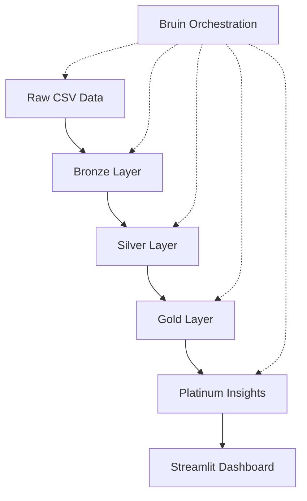
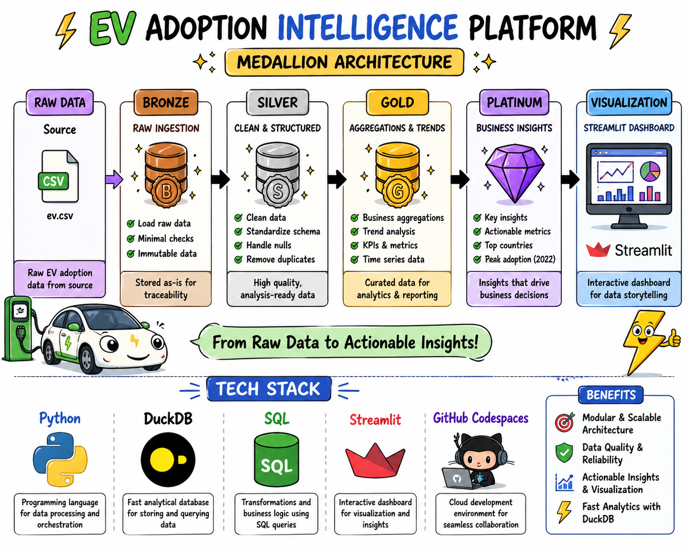

# 🚗⚡ EV Adoption Intelligence Platform


---
## 📌 Overview
An end-to-end **data engineering project** analyzing electric vehicle adoption trends using a **Medallion Architecture (Bronze → Silver → Gold → Platinum)**.
Built with **DuckDB + Python + Streamlit + Bruin**, this project demonstrates **modern data pipeline design, transformation, data quality checks, and interactive analytics** powered by enterprise-grade data orchestration.
---
## 🏗️ Architecture

## ⚙️ Tech Stack
| Layer           | Technology        | Purpose                          |
| --------------- | ----------------- | -------------------------------- |
| Storage         | DuckDB            | Analytical database              |
| Processing      | Python            | Data processing logic            |
| Transformation  | SQL               | Data transformations             |
| Orchestration   | Bruin CLI         | Pipeline orchestration & quality |
| Visualization   | Streamlit         | Interactive dashboards           |
| Dev Environment | GitHub Codespaces | Cloud-based development          |
---
## 🧩 Control Flow on Tech Stack

---
## 🚀 Features
✨ Modular medallion pipeline
📊 SQL-based transformations
✅ Automated data quality checks
📈 EV adoption trend analysis
🌐 Interactive Streamlit dashboard
**🎯 Bruin-powered orchestration with 200+ data connectors**
---

## 📊 Key Insights
🔥 EV adoption surged significantly post-2017
🚀 Peak adoption observed in **2022**
📈 Strong upward trend in recent years
---
## 📸 Dashboard Preview
> *(Add screenshot here for maximum impact)*
```bash
/images/dashboard.png
```
---
## ▶️ How to Run

### 🛠 Setup Bruin Environment
```bash
# Install Bruin CLI
pip install bruin

# Initialize Bruin pipeline (if not already done)
bruin init [template] ev-project

# Configure connections in .bruin.yml
bruin connections test --name duckdb
```

### 🚀 Run Data Pipeline with Bruin
```bash
# Run entire pipeline
bruin run

# Run specific asset
bruin run assets/bronze/raw_ev_data.sql

# Validate pipeline
bruin validate

# Check lineage
bruin lineage
```

### 📊 Launch Dashboard
```bash
streamlit run dashboard/app.py
```

### 🔍 Data Quality Validation
```bash
# Run quality checks
bruin validate --fail-if-errors

# Query specific data
bruin query --connection duckdb --query "SELECT * FROM platinum_insights" --description "Verify EV insights"
```

---
## 📁 Project Structure
```bash
ev_project/
│
├── assets/
│   ├── bronze/
│   │   ├── raw_ev_data.sql
│   │   └── raw_ev_data.asset.yml
│   ├── silver/
│   │   ├── clean_ev_data.sql
│   │   └── clean_ev_data.asset.yml
│   ├── gold/
│   │   ├── aggregated_ev_trends.sql
│   │   └── aggregated_ev_trends.asset.yml
│   └── platinum/
│       ├── ev_insights.sql
│       └── ev_insights.asset.yml
│
├── pipeline.yml
│
├── dashboard/
│   └── app.py
│
├── data/
│   └── ev.csv
│
├── scripts/
│   └── data_quality.py
│
├── .bruin.yml
├── run_pipeline.py
├── dev.db
└── README.md
```

### Key Files Explained
- **pipeline.yml**: Bruin pipeline configuration with scheduling and orchestration
- **.bruin.yml**: Connection credentials and environment configuration (gitignored)
- **assets/*.asset.yml**: Individual asset metadata and quality check definitions
- **assets/*.sql**: SQL transformation files with column-level lineage

---
## ✅ Data Quality Checks
✔ Row count validation across all layers
✔ Null value checks on critical columns
✔ Gold layer business logic validation
✔ Platinum insights accuracy verification
✔ Column-level lineage tracking
✔ Custom Bruin quality rules enforcement
---
## 🎯 What This Project Demonstrates
* Enterprise-grade data engineering pipeline design
* Medallion architecture implementation with Bruin orchestration
* SQL & Python transformation logic
* Automated data quality management
* Analytical data modeling
* Dashboard-driven insights
* CI/CD integration with data validation
* Modern data stack best practices
---
## 📌 Future Improvements
🚀 CI/CD pipeline integration with GitHub Actions
☁️ Cloud deployment (Azure / AWS / GCP)
⚡ Real-time streaming ingestion with Bruin connectors
📊 Advanced dashboard analytics with ML models
🔔 Real-time alerting on data quality issues
📱 Mobile-friendly dashboard interface
---
## 🛠️ Development Guide

### Adding a New Transformation
1. Create asset file: `assets/[layer]/[name].sql`
2. Create metadata: `assets/[layer]/[name].asset.yml`
3. Define quality checks in the asset YAML
4. Test locally: `bruin run assets/[layer]/[name].sql`
5. Validate: `bruin validate`
6. Commit and push to GitHub

### Debugging
```bash
# View pipeline logs
bruin run --log-level debug

# Compare outputs between environments
bruin diff --environment staging,production

# Validate specific connections
bruin connections test --name duckdb
```

## 🔧 Bruin Data Pipeline Integration

This project leverages **Bruin**, an open-source, end-to-end data platform, for robust pipeline orchestration and data quality management.

### 📊 Data Ingestion & Connectivity
- **200+ Data Connectors**: Seamlessly integrate EV data from multiple sources and platforms
- **CLI-Based Ingestion**: Simple command-line tools to import and manage data from any source to any destination
- **Multi-Source Support**: Handle diverse data formats and sources effortlessly

### 🔧 Flexible Transformation Layer
- **SQL & Python Support**: Write transformations in SQL for efficiency or Python for complex logic
- **Python Environments**: Isolated, version-controlled Python environments with automatic dependency management
- **Jinja Template Support**: Reduce code repetition and improve maintainability with templating
- **Native Integration**: SQL and Python assets coexist in the same DAG with automatic dependency resolution

### ✅ Built-In Data Quality & Governance
- **Automated Quality Checks**: Define and enforce data quality rules across all assets
- **Column-Level Lineage**: Track data flow and dependencies at the column level for complete visibility
- **Custom Checks**: Create custom SQL-based quality validations tailored to EV data requirements
- **End-to-End Observability**: Monitor pipelines with comprehensive logging and tracing

### 🔐 Security & Credential Management
- **Secure Secrets Handling**: Manage credentials safely through `.bruin.yml` configuration
- **Environment-Based Execution**: Run pipelines against staging or production environments seamlessly
- **No Hardcoded Credentials**: Automatic injection of secrets as environment variables

### 📦 Deployment Flexibility
- **Self-Hosted or Managed Cloud**: Choose to host on your infrastructure or use managed Bruin Cloud
- **No Vendor Lock-In**: Open-source with Apache License and MIT licensing available
- **Multi-Environment Support**: Deploy across development, staging, and production with configuration
- **Local & Remote Execution**: Run pipelines locally for development or on managed infrastructure

### 🎯 Developer Experience
- **VS Code Extension**: Visual pipeline development with built-in data catalog and lineage visualization
- **Version Control Integration**: Code-first approach enables full Git integration and CI/CD workflows
- **Local Development**: Run and test pipelines locally before deployment
- **Comprehensive CLI**: Powerful command-line interface for all pipeline operations

### 🤖 AI-Powered Analytics
- **Automated Documentation**: AI-generated descriptions and metadata for data assets
- **Intelligent Analysis**: Automated insights and anomaly detection in EV adoption trends
- **Data-Driven Checks**: ML-powered quality checks based on historical patterns

### 💡 Key Benefits for EV Adoption Intelligence
- **Reduced Complexity**: Single unified framework eliminates tool sprawl
- **Faster Time-to-Insight**: Accelerated data processing and analysis pipelines
- **Scalability**: Handle growing EV data volumes with ease
- **Community-Driven**: Active open-source community with continuous improvements
- **Production-Ready**: Enterprise-grade reliability with built-in observability
---
## 📚 Resources
- [Bruin Documentation](https://getbruin.com/docs)
- [DuckDB Guide](https://duckdb.org/docs)
- [Streamlit Documentation](https://docs.streamlit.io)
- [Medallion Architecture Pattern](https://www.databricks.com/blog/2022/06/24/use-the-medallion-lakehouse-architecture.html)

---
## 👨‍💻 Author
**Livin Vincent**
Senior Data Engineer
🔗 [GitHub](https://github.com/livinvincentDE)
🔗 [LinkedIn](https://linkedin.com/in/livinvincent)
